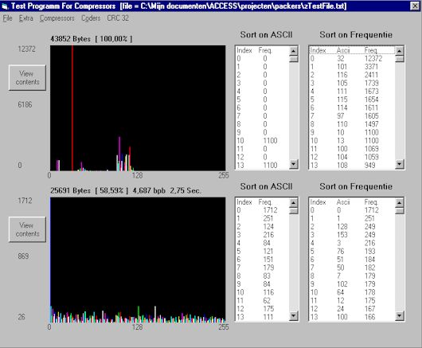



## \_\+Compression Methods\+\_ V 1\.02

### Description

This programm has a collection of 61 compression algorithms

and 20 different coders to do al kind of things with the data

This program is totally written in VB and makes no use of any DLL

This is an exelent programm for someone who want to do something

with compression. Some Algorithms can be slow but the most of

them are fast enough considdering its only VB.

The most commen algoritms are also inplemented like 'Huffman','LZSS',

'LZW','RLE','Aritmatic','LBE' and some of them are 'invented' by me

just to see what the results would be.

I hope that most of the problems found by users are fixed
 
### More Info
 

             |
---                |---
**Submitted On**   |2002-01-25 15:32:24
**By**             |[Marco v/d Berg](https://github.com/Planet-Source-Code/PSCIndex/blob/master/ByAuthor/marco-v-d-berg.md)
**Level**          |Intermediate
**User Rating**    |4.9 (801 globes from 162 users)
**Compatibility**  |VB 6\.0
**Category**       |[Files/ File Controls/ Input/ Output](https://github.com/Planet-Source-Code/PSCIndex/blob/master/ByCategory/files-file-controls-input-output__1-3.md)
**World**          |[Visual Basic](https://github.com/Planet-Source-Code/PSCIndex/blob/master/ByWorld/visual-basic.md)
**Archive File**   |[\_\+Compress509431252002\.zip](https://github.com/Planet-Source-Code/marco-v-d-berg-compression-methods-v-1-02__1-31141/archive/master.zip)

